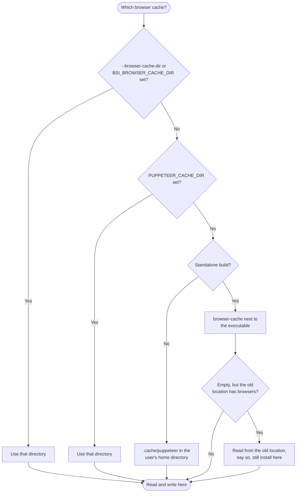

# Browser Cache Directory

Butler Sheet Icons drives a real Chrome browser to photograph each sheet. That browser is downloaded once and kept in a folder called the **browser cache**.

You can choose where that folder is, and on the standalone builds the default has moved.

::: warning Requires BSI 5.0.0 or later
In earlier versions the browser cache was always `.cache/puppeteer` in the home directory of whichever account ran Butler Sheet Icons. There was no way to change it, and `PUPPETEER_CACHE_DIR` was ignored.
:::

Two things changed:

- You can now say where the folder is, with `--browser-cache-dir` or the `BSI_BROWSER_CACHE_DIR` environment variable.
- The **standalone builds** — `butler-sheet-icons.exe` on Windows, `butler-sheet-icons` on Linux and macOS — now keep the browser in a `browser-cache` folder **next to the executable** instead.

Nothing changes if you run Butler Sheet Icons from Node.js or from the [Docker image](/guide/advanced/docker). The Docker image ships its own browser and does not use the cache at all.

## Why the home directory was the wrong place

On a Qlik Sense Enterprise on Windows server, Butler Sheet Icons is usually run by the scheduler or as an external program task — that is, by a **service account**, not by you.

If that account is LocalSystem, its home directory is `C:\Windows\system32\config\systemprofile`. So when you sign in as yourself, run `butler-sheet-icons browser install`, and see it succeed, the browser lands in **your** profile. The scheduled task then looks in the service account's profile, finds nothing, and downloads its own copy — or, on a server with no internet access, fails.

Nothing in the old output explained this, because both runs printed the same reassuring lines.

Keeping the browser next to the executable makes it follow the **installation** rather than the account that happens to run it. Everyone who runs that copy of Butler Sheet Icons uses the same browser.

## Where Butler Sheet Icons looks

The first of these that is set wins:

| Order | Location | Set by |
| --- | --- | --- |
| 1 | The directory you name | `--browser-cache-dir <directory>` or `BSI_BROWSER_CACHE_DIR` |
| 2 | The directory `PUPPETEER_CACHE_DIR` names | `PUPPETEER_CACHE_DIR` |
| 3 | `browser-cache` next to `butler-sheet-icons(.exe)` | Automatic, **standalone builds only** |
| 4 | `.cache/puppeteer` in the current user's home directory | Automatic, everything else |



Butler Sheet Icons says which one it used whenever it is not the last one, so a log tells you where it looked:

```
2026-08-12T07:11:05.039Z info: Browser cache directory: D:\qlik\browsers (from --browser-cache-dir / BSI_BROWSER_CACHE_DIR)
```

A relative path is resolved against the current working directory and logged in full. Under a scheduled task the working directory is rarely what you expect, so prefer a full path such as `D:\qlik\browsers`.

::: tip An empty value means "not set"
Setting the variable to nothing at all — a bare `BSI_BROWSER_CACHE_DIR=` line in a `.env` file or a container definition — is treated as unset, and Butler Sheet Icons moves on to the next row of the table. It is not an error.
:::

## If you already have a browser in the old location

Standalone builds keep working. When there is no browser next to the executable but there is one in the old location, Butler Sheet Icons uses the old one and says so, once, per run:

```
2026-08-12T07:12:27.745Z info: No browsers found in C:\butler-sheet-icons\browser-cache, but 1 was found in the previous default location C:\Users\svc_qlik\.cache\puppeteer. Using the previous location for now. Move that directory next to the Butler Sheet Icons executable, or set --browser-cache-dir, to keep using it.
```

Nothing is re-downloaded and nothing breaks, so there is no hurry. To make the message go away, do one of the following:

- **Move the folder.** Copy `C:\Users\svc_qlik\.cache\puppeteer` to `C:\butler-sheet-icons\browser-cache`, so that the `chrome` folder inside it ends up as `C:\butler-sheet-icons\browser-cache\chrome`.
- **Or keep it where it is**, and set `BSI_BROWSER_CACHE_DIR=C:\Users\svc_qlik\.cache\puppeteer`.
- **Or run [`browser install`](/reference/browser#install) once**, which downloads a browser into the new location.

Two details worth knowing:

- Reading from the old location is a **fallback only**. An install always writes to the location in the table above, so once you install a browser next to the executable, that is the one that gets used. The cache migrates by being used, rather than growing a second copy.
- The fallback applies only to the standalone default. If you name a directory yourself, or set `PUPPETEER_CACHE_DIR`, Butler Sheet Icons uses exactly that and does not look anywhere else — if you said where the browser is, it will not quietly read a different copy.

## `PUPPETEER_CACHE_DIR` now does something

`PUPPETEER_CACHE_DIR` is a well-known variable in the Puppeteer world, and Butler Sheet Icons has always ignored it. It is now honoured, ranking just below Butler Sheet Icons' own setting.

::: warning Check whether this variable is already set on your servers
If you already have it set on a machine for other reasons, Butler Sheet Icons will start looking there and may report that no browsers are installed. The `info` line above is what tells you that has happened.

Either point it at the folder that holds your browser, or set `BSI_BROWSER_CACHE_DIR`, which wins over it.
:::

`PUPPETEER_EXECUTABLE_PATH` is unchanged and is a different thing: it names one browser **binary** to use and skips the cache entirely. See [Browser detection and environment variables](/guide/concepts/browser-detection-and-environment-variables).

## Which commands accept it

| Command | `--browser-cache-dir` |
| --- | --- |
| [`browser install`](/reference/browser#install) | Yes — this is where the browser is downloaded to |
| [`browser list-installed`](/reference/browser#list-installed) | Yes |
| [`browser uninstall`](/reference/browser#uninstall) | Yes |
| [`browser uninstall-all`](/reference/browser#uninstall-all) | Yes |
| [`qseow create-sheet-thumbnails`](/reference/qseow) | Yes |
| [`qscloud create-sheet-thumbnails`](/reference/qscloud) | Yes |
| [`browser list-available`](/reference/browser#list-available) | **No** — it lists what is published for download and never reads the cache |

The environment variable is `BSI_BROWSER_CACHE_DIR` for all of them. It is deliberately **not** per-command, unlike most Butler Sheet Icons variables: where the browser lives is a property of the machine, and the folder `browser install` writes to has to be the one `create-sheet-thumbnails` reads from. Set it once, in the environment the scheduled task runs in, and every command agrees.

Both thumbnail wizards ask about it under **advanced options**, where you can leave it blank. See [Interactive Mode](/guide/interactive-mode).

## If the folder cannot be written to

A standalone build unzipped under `C:\Program Files\` cannot write next to itself. `browser install` stops immediately and says what to do, instead of failing part-way through a 150 MB download with a permission error:

```
2026-08-12T07:11:41.546Z error: Cannot write to the browser cache directory C:\Program Files\butler-sheet-icons\browser-cache. Choose a writable location with --browser-cache-dir or BSI_BROWSER_CACHE_DIR, or run Butler Sheet Icons from a directory you can write to.
```

The exit code is 1.

## `browser uninstall-all` no longer empties the whole folder

This matters now that the folder can be one you chose. [`browser uninstall-all`](/reference/browser#uninstall-all) used to delete **everything** in the browser cache directory. It now removes only the subfolders it owns — `chrome`, `chrome-headless-shell`, `chromium`, `firefox` and `chromedriver` — so pointing `--browser-cache-dir` at a folder that also holds other files is safe.

## Example: one location for a whole server

Set the variable once, in the environment the scheduled task runs in:

::: code-group

```powershell [PowerShell]
$env:BSI_BROWSER_CACHE_DIR = 'D:\qlik\butler-sheet-icons\browsers'
```

```bash [Bash]
export BSI_BROWSER_CACHE_DIR='/opt/butler-sheet-icons/browsers'
```

:::

Then, signed in as yourself, stage the browser into that same folder:

::: code-group

```powershell [PowerShell]
butler-sheet-icons.exe browser install --browser-cache-dir D:\qlik\butler-sheet-icons\browsers
```

```bash [Bash]
./butler-sheet-icons browser install --browser-cache-dir /opt/butler-sheet-icons/browsers
```

:::

Check what is there. As the service account or as yourself, the answer is now the same either way:

::: code-group

```powershell [PowerShell]
butler-sheet-icons.exe browser list-installed --browser-cache-dir D:\qlik\butler-sheet-icons\browsers
```

```bash [Bash]
./butler-sheet-icons browser list-installed --browser-cache-dir /opt/butler-sheet-icons/browsers
```

:::

## Related

- [Browser Management](/guide/concepts/browser-management) — which browser is used, and how a build is chosen
- [Browser detection and environment variables](/guide/concepts/browser-detection-and-environment-variables) — the order in which a browser is found, and `PUPPETEER_EXECUTABLE_PATH`
- [Browser Commands Reference](/reference/browser) — every option, per command
- [Docker Usage](/guide/advanced/docker) — why none of this applies to the container image
