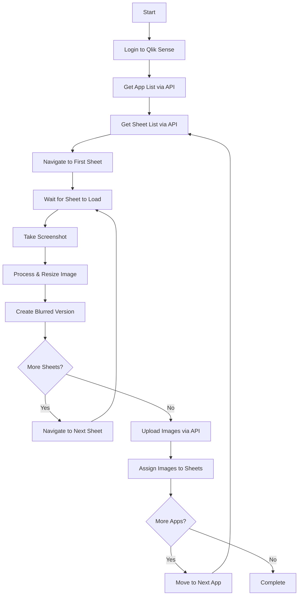

# How Butler Sheet Icons Works

Butler Sheet Icons automates the human workflow of creating sheet thumbnails by driving a browser for screenshots and using Qlik Sense APIs for fast discovery and assignment.

## End-to-end workflow

## What happens at each step

1. Initialize & sign in — Launches a clean browser session (headless by default). See [Browser management](/guide/concepts/browser-management). Auth: API key + web login (QS Cloud) or certificates + web login (QSEoW). Store secrets via [Environment variables](/guide/concepts/environment-variables).

1. Discover apps — Lists target apps via APIs (single app, by tag on QSEoW, or by collection on QS Cloud). Platform specifics: [QS Cloud config](/guide/configuration/qlik-sense-cloud) and [QSEoW config](/guide/configuration/qseow).

1. Select sheets — Reads sheet metadata via Engine APIs and applies rules to skip or blur certain sheets. See [Sheet exclusion](/guide/concepts/sheet-exclusion) and [Sheet blurring](/guide/concepts/sheet-blurring).

1. Capture screenshots — Navigates each sheet in the browser, waits for rendering, and captures the requested area (content only, with title, with selections, or full page). See [Sheet parts](/guide/concepts/sheet-parts) and [Browser management](/guide/concepts/browser-management).

1. Process images — Resizes to thumbnail and optionally produces a blurred variant for sensitive content. Details in [Sheet blurring](/guide/concepts/sheet-blurring).

1. Upload and assign — Uploads images (QSEoW via QRS content libraries, QS Cloud via cloud APIs) and assigns them to sheets. Options are covered in the platform-specific configuration pages.

## Tips and pointers

- Toggle headless mode or slow down navigation when debugging. See [Browser management](/guide/concepts/browser-management).
- Keep credentials and tokens out of CLI history. See [Environment variables](/guide/concepts/environment-variables).
- For CLI flags and advanced usage, see [Commands reference](/reference/commands) and [Browser reference](/reference/browser).

## Related topics

- Browser management: [/guide/concepts/browser-management](/guide/concepts/browser-management)
- Sheet parts (what gets captured): [/guide/concepts/sheet-parts](/guide/concepts/sheet-parts)
- Sheet exclusion: [/guide/concepts/sheet-exclusion](/guide/concepts/sheet-exclusion)
- Sheet blurring: [/guide/concepts/sheet-blurring](/guide/concepts/sheet-blurring)
- Environment variables: [/guide/concepts/environment-variables](/guide/concepts/environment-variables)
- Configuration (QS Cloud): [/guide/configuration/qlik-sense-cloud](/guide/configuration/qlik-sense-cloud)
- Configuration (QSEoW): [/guide/configuration/qseow](/guide/configuration/qseow)
- Commands reference: [/reference/commands](/reference/commands)
- Browser reference: [/reference/browser](/reference/browser)
