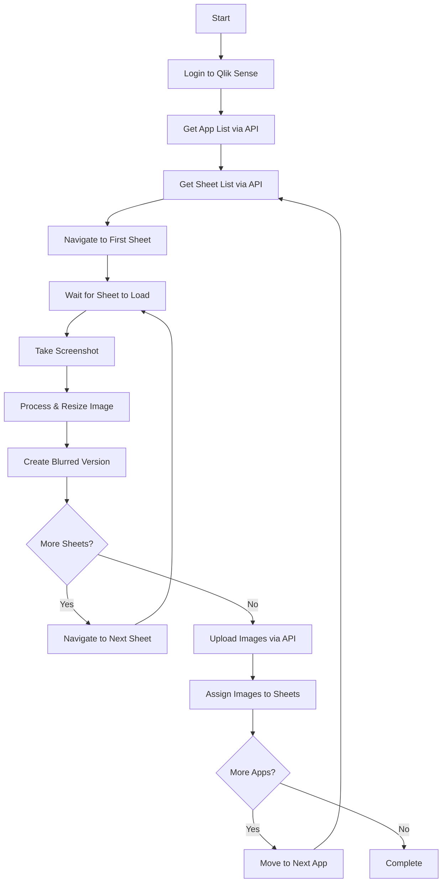

# How Butler Sheet Icons Works

Butler Sheet Icons automates the process of creating sheet thumbnails by mimicking what a human would do, but with programmatic efficiency and API integration.

## The Challenge

Creating meaningful sheet thumbnails manually involves:
1. Opening each sheet in a browser
2. Taking screenshots 
3. Cropping and resizing images
4. Uploading images to Qlik Sense
5. Assigning images to sheets
6. Repeating for dozens or hundreds of sheets across multiple apps

This process is time-consuming, inconsistent, and error-prone when done manually.

## The Solution: Automated Mimicry

Butler Sheet Icons solves this by automating the human workflow while leveraging Qlik Sense APIs for efficiency:

## Detailed Process Flow

### 1. Initialization & Authentication

**Browser Setup:**
- Downloads and installs headless browser if needed
- Configures browser with appropriate settings
- Sets up network interception for debugging

**Authentication:**
- **QS Cloud**: Uses API key + web login credentials
- **QSEoW**: Uses certificates for API + web credentials for UI

### 2. App Discovery

**API-Driven Discovery:**
- Queries Qlik Sense APIs to find target applications
- Supports multiple selection methods:
  - Single app by ID
  - Multiple apps by tag (QSEoW)
  - Multiple apps by collection (QS Cloud)

**Filtering Applied:**
- Validates app accessibility
- Checks user permissions
- Applies any app-level exclusions

### 3. Sheet Analysis

**For Each Target App:**
- Uses Qlik Sense Engine API to enumerate sheets
- Retrieves sheet metadata (title, status, tags, position)
- Applies sheet-level filtering rules:
  - Exclusion by number, title, status, or tag
  - Blur designation by number, title, status, or tag
  - Hidden sheet detection and exclusion

### 4. Screenshot Capture

**Browser Navigation:**
- Navigates to each sheet using web interface
- Waits for specified time (`--pagewait`) for sheet rendering
- Handles complex sheets with longer load times

**Screenshot Process:**
- Captures screenshot of specified sheet area:
  - Area 1: Main sheet content only
  - Area 2: Sheet content + title
  - Area 3: Sheet content + title + selection bar  
  - Area 4: Full page including menu bar
- Saves original screenshot to disk
- Creates resized thumbnail version
- Generates blurred version for potential use

**Error Handling:**
- Retries failed screenshots
- Logs navigation issues
- Continues with remaining sheets if one fails

### 5. Image Processing

**Standard Processing:**
- Resizes images to appropriate thumbnail dimensions
- Optimizes for web display
- Maintains aspect ratios
- Applies consistent quality settings

**Blur Processing:**
- Creates blurred versions of all images
- Blur intensity controlled by `--blur-factor` parameter
- Maintains image structure while obscuring content
- Useful for sensitive or development sheets

### Blur Effect Examples

| Blur Factor | Result |
|-------------|---------|
| 0 (No blur) |  |
| 5 (Default) |  |
| 10 (Medium) |  |

### 6. Upload & Assignment

**Content Library Upload:**
- **QSEoW**: Uploads to specified content library via QRS API
- **QS Cloud**: Uploads directly via Cloud APIs
- Handles existing images (overwrites or creates new)

**Sheet Assignment:**
- Uses Qlik Sense APIs to assign uploaded images to sheets
- Applies blurred images to sheets matching blur criteria
- Maintains audit trail of changes
- Handles assignment failures gracefully

## Technology Stack

### Core Components

**Headless Browser (Puppeteer):**
- Chrome or Firefox automation
- JavaScript execution environment
- Network interception capabilities
- Screenshot and PDF generation

**Qlik Sense APIs:**
- **Engine API**: App and sheet metadata
- **Repository API (QSEoW)**: Content management
- **Cloud APIs**: Tenant and app management
- **WebSocket Protocol**: Real-time communication

**Image Processing:**
- Screenshot capture and manipulation
- Resize and optimization routines
- Blur effect algorithms
- Format conversion (PNG/JPEG)

### Architecture Benefits

**API-First Approach:**
- Faster than pure web scraping
- More reliable than screen automation
- Provides rich metadata access
- Enables bulk operations

**Hybrid Web/API Model:**
- Screenshots require web interface (visual accuracy)
- Metadata and uploads use APIs (speed and reliability)
- Best of both approaches

**Browser Isolation:**
- Each run uses clean browser state
- No interference from existing sessions
- Consistent authentication flow
- Predictable screenshot results

## Performance Characteristics

### Speed Factors

**Fast Operations:**
- API calls (app/sheet discovery)
- Image uploads
- Sheet assignments

**Slower Operations:**
- Browser navigation between sheets
- Page rendering and wait times
- Screenshot capture and processing

### Optimization Strategies

**Parallel Processing:**
- Multiple apps can be processed sequentially
- Image processing happens while navigating to next sheet
- Upload batching for efficiency

**Caching:**
- Browser instances reused within session
- API responses cached where appropriate
- Image processing pipeline optimized

**Wait Time Tuning:**
- `--pagewait` parameter balances speed vs accuracy
- Complex sheets may need longer wait times
- Simple sheets can use shorter waits

### Typical Performance

**Single Sheet:**
- Navigation: 2-5 seconds
- Screenshot: 1-2 seconds  
- Processing: <1 second
- **Total: 3-8 seconds per sheet**

**Full App (10 sheets):**
- Initial setup: 10-15 seconds
- Per sheet: 3-8 seconds
- Upload batch: 5-10 seconds
- **Total: 1-3 minutes per app**

## Error Handling & Resilience

### Graceful Degradation

**Sheet-Level Failures:**
- Continue processing remaining sheets
- Log specific failure reasons
- Provide summary of successful vs failed operations

**App-Level Failures:**
- Continue with remaining apps
- Isolate failures to specific apps
- Maintain overall process integrity

### Common Failure Scenarios

**Authentication Issues:**
- API key expiration
- Certificate problems
- Password changes
- Network connectivity

**Sheet Access Problems:**
- Permission restrictions
- Hidden or deleted sheets
- App publication state changes

**Technical Failures:**
- Browser crashes
- Network timeouts
- Disk space issues
- Memory constraints

### Recovery Mechanisms

**Automatic Retries:**
- Failed screenshots retried with longer wait times
- Network requests retried with exponential backoff
- Browser crashes trigger restart

**Manual Recovery:**
- Detailed logging for troubleshooting
- Option to resume from specific app/sheet
- Dry-run mode for testing

## Security & Privacy

### Data Handling

**Minimal Data Exposure:**
- Screenshots only capture visual layout
- No data values extracted or stored permanently
- Browser sessions are isolated and cleaned

**Credential Security:**
- Support for environment variables
- No credential logging or persistence
- Secure API token handling

### Privacy Controls

**Blur Functionality:**
- Automatically blur sensitive sheets
- Configurable blur intensity
- Multiple criteria for blur selection

**Exclusion Controls:**
- Skip sheets entirely if needed
- Multiple exclusion criteria
- Granular control over what gets processed

## Monitoring & Debugging

### Logging Levels

**Production (`info`):**
- Key milestones and summary information
- Error messages and warnings
- Performance metrics

**Debug (`debug`):**
- Detailed operation steps
- API request/response details
- Browser navigation events

**Development (`silly`):**
- WebSocket message traffic
- Detailed timing information
- Full request/response logging

### Visual Debugging

**Headless Mode Toggle:**
- `--headless false` shows browser window
- See exactly what Butler Sheet Icons sees
- Debug navigation and rendering issues

**Screenshot Retention:**
- All screenshots saved locally
- Before/after comparison possible
- Manual review of thumbnail quality

This architectural approach ensures Butler Sheet Icons is both powerful and reliable, handling the complexity of Qlik Sense environments while providing the speed and consistency needed for production use.